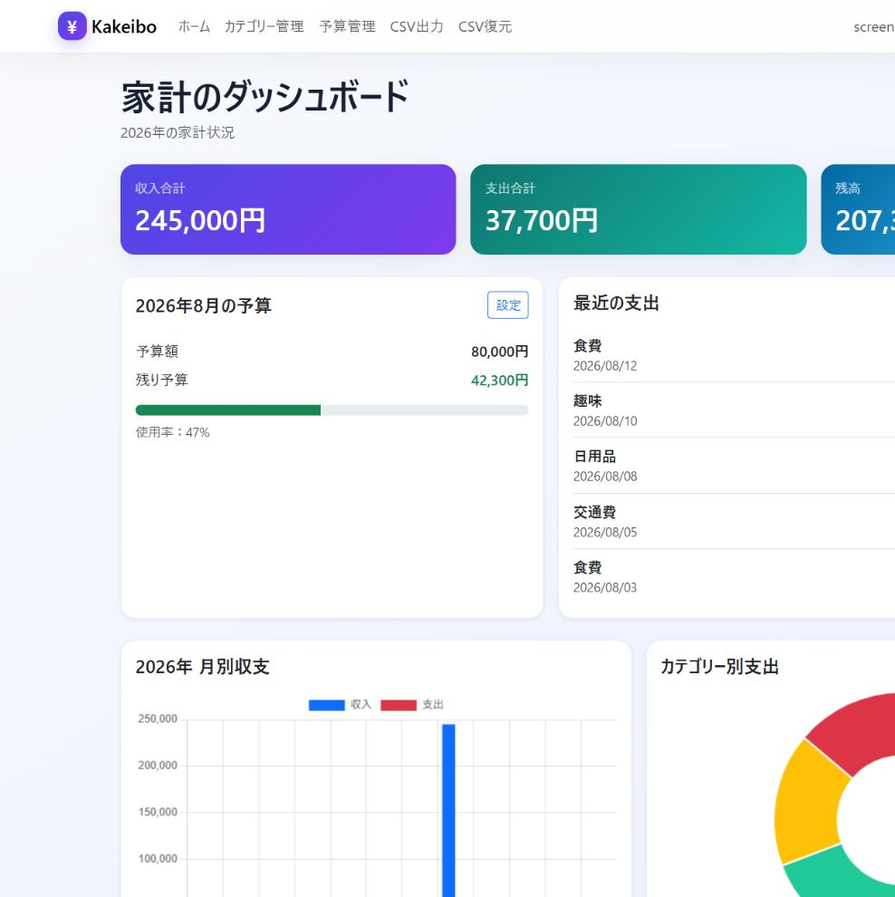
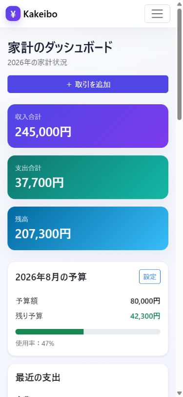

# 家計簿アプリ

Flaskで作成した、ユーザーごとに収入・支出・月間予算を管理できるWebアプリです。

**公開版:** https://kakeibo-app-ndf1.onrender.com/login

## デモアカウント

- ユーザー名：`portfolio-demo`
- パスワード：`Portfolio2026!`

自由に操作できます。共有アカウントのため、個人情報は入力しないでください。

## 画面

### PC表示



### スマートフォン表示



## 主な機能

- ユーザー登録・ログイン・ログアウト
- パスワードのハッシュ化・変更
- 収入・支出の登録、編集、削除
- 年月・カテゴリー検索、並び替え、ページネーション
- 月ごとの予算管理と使用率表示
- カテゴリーの追加、編集、削除
- カテゴリー別円グラフ・月別収支グラフ
- CSVバックアップ・復元
- ダークモード
- 404・500エラー画面
- ユーザー別のデータ分離とCSRF対策
- 今月と先月の支出比較
- 主要機能を確認する自動テスト

## 使用技術

- Python 3.13
- Flask 3.1
- Flask-SQLAlchemy
- Flask-Migrate / Alembic
- SQLite（ローカル開発）
- PostgreSQL（Render）
- Bootstrap 5
- Chart.js
- Gunicorn

## プロジェクト構成

```text
KakeiboApp/
├── app.py              # Flaskアプリの設定・起動
├── models.py           # データベースモデル
├── utils.py            # ログイン確認などの共通処理
├── routes/             # 機能ごとのBlueprint
├── static/css/         # アプリ共通のデザイン
├── templates/          # HTMLテンプレート
├── tests/              # 自動テスト
├── migrations/         # データベース変更履歴
├── .github/workflows/  # GitHub Actions
├── render.yaml         # Renderの公開設定
├── requirements.txt
├── main.py             # 開発初期に作成したCLI版
└── kakeibo.json        # CLI版のサンプルデータ
```

## ローカルでの起動方法

```powershell
git clone https://github.com/kaito-dev576/KakeiboApp.git
cd KakeiboApp
python -m venv .venv
.\.venv\Scripts\Activate.ps1
python -m pip install -r requirements.txt
$env:SECRET_KEY = python -c "import secrets; print(secrets.token_hex(32))"
python app.py
```

ブラウザで `http://127.0.0.1:5000` を開きます。

## 自動テスト

次のコマンドで、認証・取引操作・ユーザー間のデータ保護・予算計算・月比較・CSVを確認できます。

```powershell
python -m unittest discover -s tests -v
```

## 工夫した点

- すべての取引・予算・カテゴリーをユーザー単位で分離
- POST操作にCSRF対策を適用
- 検索結果の集計と、今月の予算・前月比較を分離して誤集計を防止
- CSVバックアップと復元により、利用者自身でデータを持ち出せる設計
- スマートフォンでも情報を確認しやすいレスポンシブデザイン

## 苦労した点と改善内容

### 集計条件の分離

当初は検索結果の年間支出と先月の支出を比較していたため、前月比が正しくありませんでした。今月・先月をそれぞれ独立した条件で集計し、検索条件に影響されない月間比較へ修正しました。

### 複数ユーザーのデータ保護

URLのIDを変更して他ユーザーの取引を操作できないよう、すべての更新・削除処理でログインユーザーを確認しています。CSRF対策もPOST操作全体に適用しました。

### 公開後も安全に変更できる構成

起動時の単純なテーブル作成からFlask-Migrateへ移行しました。既存データを保持したままデータベース構造を更新でき、Renderでは公開前にマイグレーションが自動実行されます。

### 品質を継続して確認する仕組み

認証、取引CRUD、権限制御、予算、月間比較、CSVの自動テストを用意しました。GitHub Actionsにより、GitHubへ変更を送るたびにテストが自動実行されます。

## 面接で説明できるポイント

- 課題：家計の収支と予算を一画面で把握しにくい
- 解決：収入・支出・残高・予算・グラフをダッシュボードへ集約
- 設計：Blueprintで機能を分割し、ユーザー単位でデータを分離
- 品質：自動テストとGitHub Actionsで主要機能の後退を防止
- 運用：PostgreSQL、マイグレーション、ヘルスチェックを使ってRenderへ公開
- 今後：カテゴリーを文字列ではなく外部キーで管理し、監査ログも追加したい

## Renderへの公開

リポジトリ直下の `render.yaml` から、WebサービスとPostgreSQLを作成できます。Render上では`SECRET_KEY`が自動生成されます。

無料のRender PostgreSQLは作成から30日で期限切れになるため、この構成はポートフォリオのデモ用途を想定しています。

## CSVバックアップについて

CSV出力から取引データをダウンロードできます。CSV復元ではバックアップCSVを読み込んで取引を復元できます。同じCSVを複数回読み込むと取引も重複するため注意してください。
